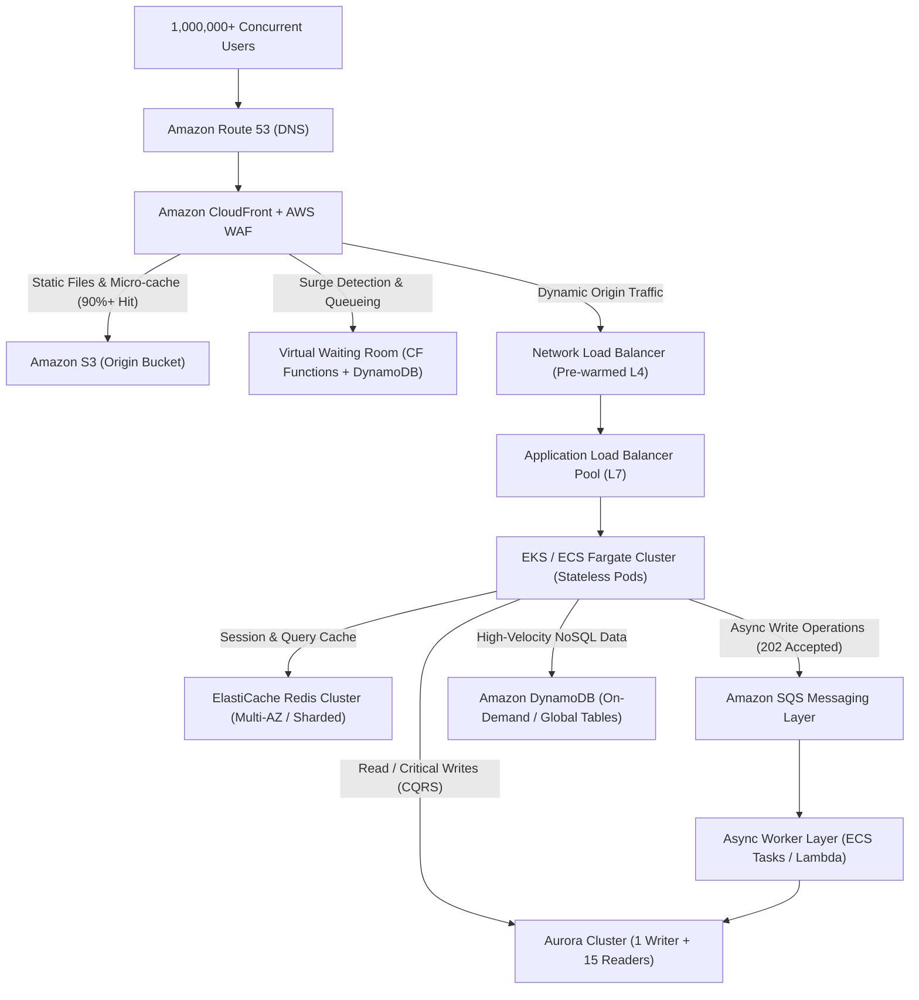

# TitanScale-AWS-IaC ⚡

> **「100万人が同時に押し寄せても、絶対に落ちない。」**
> 100万同時接続（100万CCU / 数十万RPS）の極限スパイク負荷をミリ秒単位の低遅延で捌き切る、エンタープライズグレードの超高耐障害性AWSインフラストラクチャ・コードベース。

---

## 🌟 プロジェクト概要とアーキテクチャの要点

本プロジェクトは、大規模セールや突発的バズなどによる壊滅的なトラフィックサージからサービスを死守する、クラウドネイティブな自動分散型インフラです。
単なるスケールアップに依存せず、**徹底的なエッジキャッシュ・仮想待合室・水平分散・非同期メッセージング・CQRSデータベース戦略**を組み合わせることで、オリジンDBへの負荷を最大95%遮断します。

### 🛡️ コア設計思想
1. **エッジ多段防御 (Cache Hit Ratio 95%+)**: CloudFront + AWS WAF + S3 により、オリジン到達前に静的コンテンツおよびマイクロキャッシュAPIレスポンスを遮断。
2. **Virtual Waiting Room（仮想待合室）**: 許容値（例: 20,000 req/sec）を超える突発サージをエッジ（CloudFront Functions + DynamoDB）で自動検知し、安全にキューイング。
3. **多層ロードバランシング**: Pre-warmed NLB (L4) から複数ALB (L7) への多重トラフィック分散。
4. **完全ステートレス・コンテナ層**: EKS / ECS Fargate 上で数百〜数千PodがKEDAによりリクエスト流量に応じて超高速自動スケール。
5. **非同期バッファリング**: 重い書き込みやログ集約は Amazon SQS を介して平滑化し、バックエンドワーカーが安全に遅延実行。
6. **CQRS & リードレプリカ最大化**: Aurora（Writer 1台 + Reader 最大15台）による参照分散と、超高頻度KVSデータ用 DynamoDB のハイブリッド構成。

---

## 🗺️ インフラ構成図 (Architecture Diagram)



---

## 📁 ディレクトリ構造

```text
TitanScale-AWS-IaC/
├── terraform/
│   ├── environments/
│   │   ├── prod/             # 本番環境パラメータ
│   │   └── stg/              # 検証・負荷テスト環境
│   ├── modules/
│   │   ├── edge/             # CloudFront, WAF, S3, Route53
│   │   ├── waiting_room/     # CloudFront Functions, DynamoDB (待合室)
│   │   ├── network/          # VPC, Subnets, IGW, NAT, NLB, ALB
│   │   ├── compute/          # EKS / ECS Fargate, Auto-scaling, KEDA
│   │   ├── cache/            # ElastiCache Redis Cluster
│   │   ├── messaging/        # SQS FIFO / Standard Queues
│   │   └── database/         # Aurora Multi-AZ Cluster, DynamoDB
│   ├── versions.tf           # Terraform & AWS Provider 定義
│   └── variables.tf          # 共通変数定義
├── tests/
│   └── k6/                   # 100万CCUシミュレーション用負荷試験スクリプト
└── README.md
```

---

## 🚀 展開手順 (Deployment Guide)

### 前提条件
- Terraform >= 1.5.0
- AWS CLI v2 認証済み (適切な権限を持つ IAM ロール)
- （本番適用時）AWSサポートへ NLB/ALB 事前暖機（Pre-warming）申請を完了していること

### ステップ
1. **リポジトリのクローン & 初期化**
   ```bash
   git clone https://github.com/code-refinery-works/TitanScale-AWS-IaC.git
   cd TitanScale-AWS-IaC/terraform/environments/prod
   terraform init
   ```

2. **ドライランの実行**
   ```bash
   terraform plan -out=tfplan
   ```

3. **インフラのプロビジョニング**
   ```bash
   terraform apply tfplan
   ```

4. **負荷テストの実施**
   ```bash
   cd ../../../tests/k6
   k6 run --vus 10000 --duration 10m stress-test.js
   ```

---

## 🎬 キャスト & スタッフクレジット

本プロジェクトのインフラストラクチャは、AIアプリ工場劇場のプロフェッショナル陣によって設計・検証・構築されました。

- **プロジェクト企画・要件定義**: agent🔵
- **アーキテクチャ設計・統括**: agent🍇
- **Terraform実装・自動化**: agent🍊
- **セキュリティ監査・品質担保**: agent🟢
- **総合プロデュース・進行**: agent🟡

---
*Produced by AI App Factory Theater.*